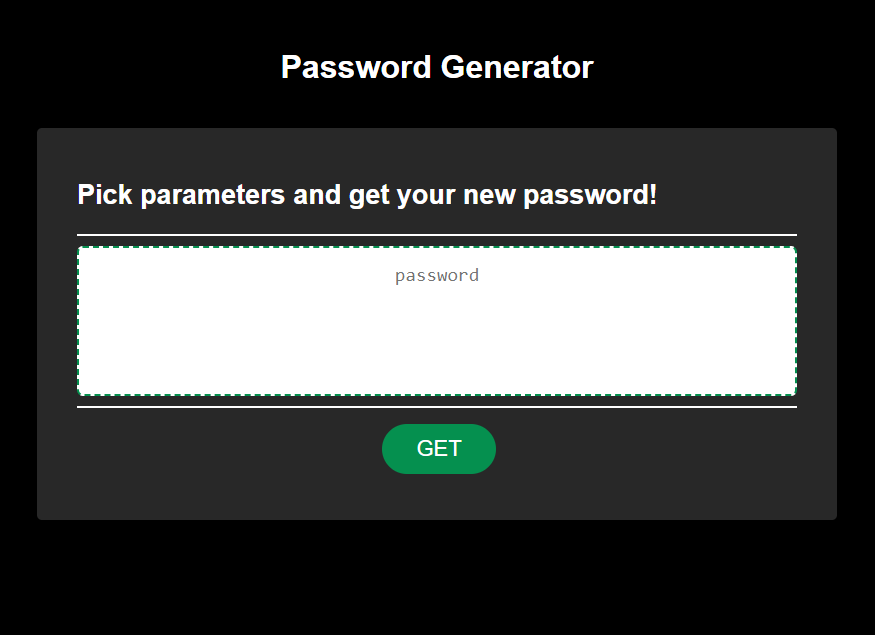

# Random Password Generator

## Description

A web application that saves a users preferences for password length, uppercase, lowercase, numbers, and special characters in order to generate a random password that encorporates all selected parameters.  

## Usage

visit: 
https://dossman-thomas.github.io/password-generator/

## Badges

